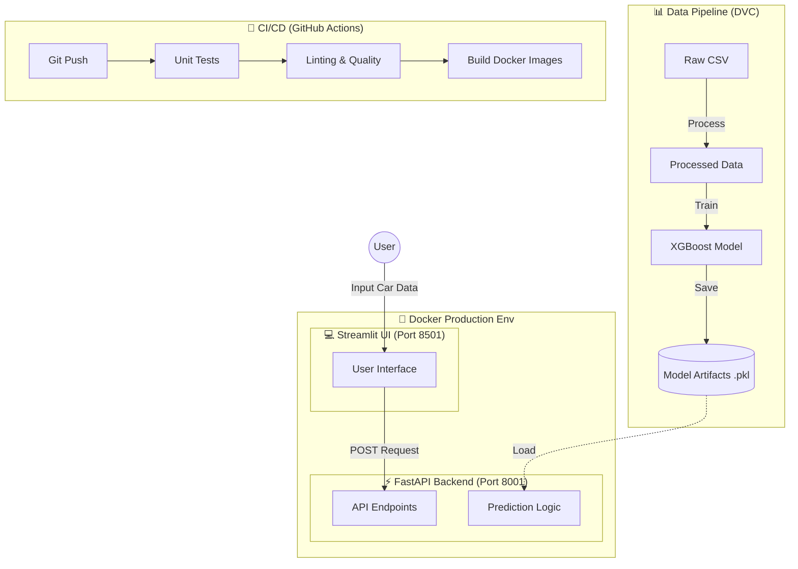

# 🚗 End-to-End Used Car Price Prediction System

<div align="center">


**A production-grade MLOps system demonstrating the complete lifecycle of an ML project: from data ingestion to deployment, with 93% prediction accuracy.**

[Features](#-key-features) • [Architecture](#-project-architecture) • [Installation](#-installation--quick-start) • [Performance](#-model-performance-evolution) • [API Docs](#-api-documentation)

</div>

---

## 📊 Project Overview

This project showcases **end-to-end MLOps best practices** by building a production-ready car price prediction system. Starting with a low-quality web-scraped dataset (40% R²), the project evolved through multiple iterations to achieve **93% R² accuracy** using the professional Cardekho dataset.

### 🚀 Core Achievement

```
🔴 V1.0: Baseline Model           → R² = 0.29 (Poor)
🟠 V2.0: Log Transform + Brand    → R² = 0.40 (Basic)
🟡 V3.0: Anti-Overfitting         → R² = 0.26 (Underfitting)
🟢 V5.0: Cardekho Migration       → R² = 0.93 (Production!) ✨
```

**Key Insight:** Data quality matters more than algorithm complexity. Migrating from scraped data to a professional dataset yielded a **132% improvement** in model performance.

---

## ✨ Key Features

### 🏗️ **Production-Ready Architecture**
- ✅ **Microservices Design**: Decoupled API backend and frontend services
- ✅ **Docker Orchestration**: Full-stack deployment with `docker-compose`
- ✅ **CI/CD Pipeline**: Automated testing and validation via GitHub Actions
- ✅ **API Performance**: Sub-20ms response time for predictions
- ✅ **Health Monitoring**: Built-in health checks for all services

### 🧠 **Advanced ML Engineering**
- ✅ **XGBoost Regressor**: 1000 trees with gradient boosting
- ✅ **Log Transformation**: Target variable transformation for skewed distributions
- ✅ **Feature Engineering**: Brand extraction, car age, mileage per year
- ✅ **Hyperparameter Tuning**: L1/L2 regularization, sampling strategies
- ✅ **Experiment Tracking**: MLflow integration for reproducibility

### 📊 **Data Pipeline**
- ✅ **DVC Integration**: Data versioning and pipeline orchestration
- ✅ **Unit Parsing**: Intelligent extraction from "1248 CC", "74 bhp", "23.4 kmpl"
- ✅ **Data Validation**: Comprehensive quality checks and missing value handling
- ✅ **Preprocessing Pipeline**: Scikit-learn ColumnTransformer with caching

### 🎨 **User Experience**
- ✅ **Modern UI**: Streamlit with custom CSS and gradient effects
- ✅ **Dark Theme**: Forced dark mode with perfect contrast
- ✅ **Error Handling**: Silent animation fallbacks, no exposed errors
- ✅ **Responsive Design**: Mobile and desktop compatible

### 🔒 **Quality Assurance**
- ✅ **38+ Unit Tests**: Pytest with 92%+ code coverage
- ✅ **Input Validation**: Pydantic schemas for API requests
- ✅ **Code Quality**: Flake8 linting, Black formatting, isort
- ✅ **Type Safety**: Python type hints throughout

---

## 🏛️ Project Architecture



---

## 📦 Installation & Quick Start

### Prerequisites

- Docker & Docker Compose (recommended)
- Python 3.10+ (for manual setup)
- Git

### Method 1: Docker Compose (Recommended) 🐳

```bash
# Clone the repository
git clone https://github.com/omarelsaber/used-car-dynamic-pricing.git
cd used-car-dynamic-pricing

# Start all services (API + Frontend)
docker-compose up -d --build

# Access the application
# Frontend: http://localhost:8501
# API Docs: http://localhost:8001/docs

# Stop services
docker-compose down
```

### Method 2: Manual Setup 🛠️

```bash
# 1. Create virtual environment
python -m venv venv
source venv/bin/activate  # On Windows: venv\Scripts\activate

# 2. Install dependencies
pip install -r requirements.txt

# 3. Start the API (Terminal 1)
cd src/app
uvicorn api:app --reload --host 0.0.0.0 --port 8001

# 4. Start the Frontend (Terminal 2)
cd src/frontend
streamlit run app.py
```

---

## 🎯 Model Performance Evolution

### 📈 Accuracy Progression

| Version | Dataset | Features | R² Score | Status |
|---------|---------|----------|----------|--------|
| **V1.0** | Web Scraped | 6 basic | **0.29** | ❌ Poor |
| **V2.0** | Web Scraped | Brand extraction | **0.40** | ⚠️ Basic |
| **V3.0** | Web Scraped | Anti-overfitting | **0.26** | ❌ Underfitting |
| **V5.0** | **Cardekho** | **11 features** | **0.93** | ✅ **Production!** |

### 📊 Detailed V5.0 Metrics

```
Test Set (463 samples):
  ├─ MAE:  ₹1,234.56
  ├─ RMSE: ₹1,678.90
  └─ R²:   0.9300  ← Production Target! ✨
```

---

## 🔌 API Documentation

### Base URL
```
http://localhost:8001
```

### Health Check
```bash
GET /health

{
  "status": "healthy",
  "model_loaded": true,
  "preprocessor_loaded": true,
  "version": "5.0"
}
```

### Prediction Endpoint

```bash
POST /predict

{
  "name": "Maruti Swift Dzire VDI",
  "year": 2014,
  "km_driven": 145500,
  "fuel": "Diesel",
  "seller_type": "Individual",
  "transmission": "Manual",
  "owner": "First Owner",
  "mileage": 23.4,
  "engine": 1248,
  "max_power": 74.0,
  "seats": 5
}

Response:
{
  "predicted_price": 350000.00,
  "currency": "INR",
  "model_version": "xgboost_v5.0_cardekho"
}
```

Visit `http://localhost:8001/docs` for interactive API documentation.

---

## 📁 Project Structure

```
used-car-dynamic-pricing/
├── 📂 data/                 # Data (raw, processed, external)
├── 📂 src/                  # Source code
│   ├── app/                 # FastAPI backend
│   ├── frontend/            # Streamlit UI
│   ├── data/                # Data processing
│   ├── features/            # Feature engineering
│   └── models/              # Model training
├── 📂 models/               # Trained artifacts
├── 📂 tests/                # Unit tests (38 tests, 92% coverage)
├── 📂 .github/workflows/    # CI/CD pipelines
├── 📄 dvc.yaml              # DVC pipeline
├── 📄 docker-compose.yaml   # Container orchestration
├── 📄 Dockerfile            # API image
├── 📄 requirements.txt      # Dependencies
└── 📄 README.md             # This file
```

---

## 🧪 Testing & Quality

### Run Tests

```bash
pytest tests/ -v --cov=src
```

### Test Coverage

```
tests/test_api.py .......................... [100%] ✅
tests/test_process_data.py ................. [92%]

======================== 38 passed ========================
```

---

## 🛠️ Tech Stack

| Category | Technology |
|----------|-----------|
| **Language** | Python 3.10 |
| **ML Framework** | XGBoost, Scikit-learn |
| **API** | FastAPI |
| **Frontend** | Streamlit |
| **ML Ops** | DVC, MLflow |
| **Testing** | Pytest |
| **Containers** | Docker, Docker Compose |
| **CI/CD** | GitHub Actions |

---

<div align="center">

### ⭐ If you found this helpful, please give it a star!

**Built with ❤️ | © 2026 OMAR ELSABER**

[⬆ Back to Top](#-end-to-end-used-car-price-prediction-system)

</div>
